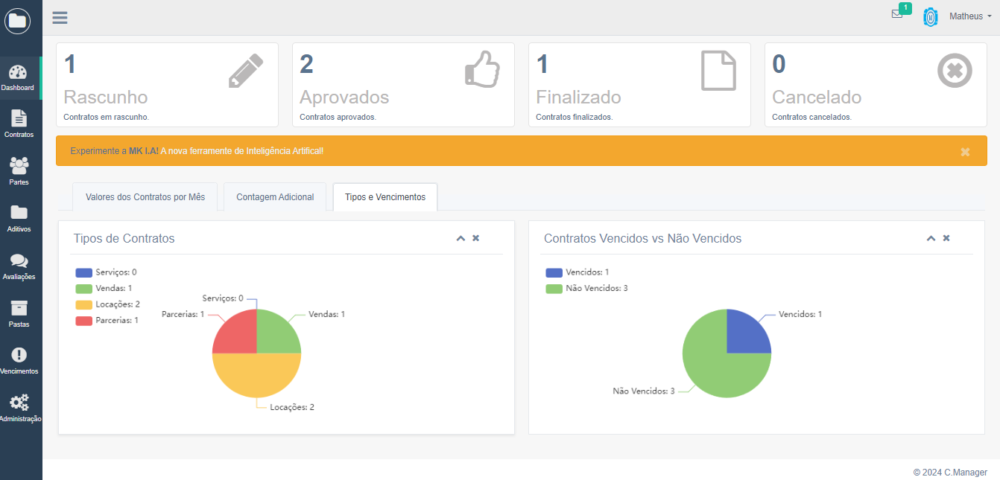

# ContractsManager - Sistema de Gerenciamento de Contratos

O **ContractsManager** é um sistema de gerenciamento de contratos desenvolvido com Django, criado para facilitar a administração de contratos, permitindo o cadastro, edição, visualização e exclusão de contratos, além de funcionalidades como geração de relatórios, armazenamento de documentos e inteligência artificial.

## Funcionalidades

- **Gerenciamento de Contratos**: Criação, edição, visualização e exclusão de contratos.
- **Armazenamento de Documentos**: Upload e download de PDFs relacionados aos contratos.
- **Controle de Acessos**: Definição de permissões para diferentes usuários.
- **Integração com IA**: Utilizando a biblioteca **Langchain** e modelo baseado em **Google Generative AI**, que permitem ao usuário fazer perguntas relacionadas aos contratos e receber respostas diretas e contextualizadas.
- **Relatórios**: Geração de relatórios sobre contratos ativos, vencidos, renovados, etc.
- **LGPD**: Marcação e acompanhamento do status de conformidade com a LGPD.
- **Dashboard**: Exibição de informações importantes como o número de contratos aprovados, aditivos, avaliações e outras informações agregadas.
- **Filtros Avançados**: Filtragem de contratos por datas e status, com visualização em tempo real.
- **Histórico de Ações**: Exibição de atividades recentes no estilo de “Recent Activity” com detalhes de autor e data.





## Instalação

1. Clone o repositório:

   ```bash
   git clone https://github.com/matheuskdev/contracts_manager.git .
   ```

2. Crie um ambiente virtual e instale as dependências:

   ```bash
   python -m venv venv
   source venv/bin/activate  # Para Linux/Mac
   # Ou para Windows: venv\Scripts\activate
   pip install -r requirements.txt
   ```

3. Execute as migrações do banco de dados:

   ```bash
   python manage.py makemigrations
   python manage.py migrate
   ```

4. Crie um superusuário para acessar o painel de administração:

   ```bash
   python manage.py createsuperuser
   ```
   ou utilize o script `create_superuser.py`:
   ```bash
   python create_superuser.py
   ```

5. Popule o banco de dados com os departamentos iniciais e associe-os ao superusuário:

   ```bash
   python manage.py populate
   ```

6. Execute os testes para garantir que tudo está funcionando corretamente:

   ```bash
   python manage.py test
   ```

7. Inicie o servidor de desenvolvimento:

   ```bash
   python manage.py runserver
   ```

   A aplicação estará disponível em [http://127.0.0.1:8000/](http://127.0.0.1:8000/).

## Uso

- Acesse o painel de administração em [http://127.0.0.1:8000/admin/](http://127.0.0.1:8000/admin/) para gerenciar usuários, contratos e configurações.

- O gerenciamento de departamentos, essencial para a regra de negócio, está disponível exclusivamente no painel de administração.

## Contribuindo

Para contribuir com o projeto, siga os passos abaixo:

1. Faça um fork do repositório.
2. Utilize o comando abaixo para garantir que seu código segue os padrões de lint:
   ```bash
   python manage.py run_code_checks
   ```
3. Crie um branch para sua feature (`git checkout -b feature/nome-da-feature`).
4. Commit suas mudanças (`git commit -m 'Adiciona nova funcionalidade'`).
5. Envie o branch para o repositório remoto (`git push origin feature/nome-da-feature`).
6. Abra um Pull Request.

---

Obrigado por contribuir para o ContractsManager!
